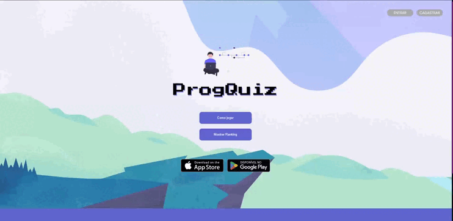

# Trabalho de Conclusão de Curso | ETEC

 

### Repositório criado em HTML para hospedar a parte visual do site no GitHub Pages, tornando possível que o professor acompanhasse o progresso do layout mais facilmente durante as entregas das documentações do TCC, a partir do penúltimo semestre do curso. 

 

### Posteriormente, foi criado um novo repositório com os códigos completos em PHP para utilizar o banco de dados e todos os integrantes contribuírem com o projeto.

 

## [⇒ Projeto completo em PHP com documentação](https://github.com/geovanaborba/TCC-website--complete_code)

 

## [⇒ Parte visual da página no GitHub Pages.](https://geovanaborba.github.io/TCC-website/)

*Obs.: Para realizar a entrada no site, basta clicar no botão "Entrar" no canto direito superior da página principal e após, no botão "entrar" da página de login*

 

<i>Tela inicial do site</i>

 

 

## Fontes: 

* [Poppins](https://fonts.google.com/specimen/Poppins?query=poppins)

* [Press Start 2P](https://fonts.google.com/specimen/Press+Start+2P?query=press+start)

 

## Cores: 

    --lilas: #8888EA;
    --laranja: #FCA82F;
    --roxo: #6066D0;
    --cinza-escuro: #535050;

 

## Sites/Ferramentas utilizadas: 

* [Fontawesome](https://fontawesome.com/)

* [unDraw](https://undraw.co/illustrations)

 

## Tutoriais / Referências utilizadas: 

 

**ARTIGOS:** 

* [Menu Dropdown com CSS puro | DevMedia](https://www.devmedia.com.br/menu-em-css-menu-dropdown-horizontal-com-html5-e-css3/37205)

* [How to create a modal box | W3Schools](https://www.w3schools.com/howto/howto_css_modals.asp)

* [Circular Progress Bar with HTML, CSS and JS](https://www.codingnepalweb.com/circular-progress-bar-html-css-javascript/)

 

**VÍDEOS:**
* [Criando um quiz estilo Duolingo | Codi Academy TV](https://youtu.be/W3WZaAQiQq0)

* [How to make a Quiz App | Brian Design](https://youtu.be/f4fB9Xg2JEY)

